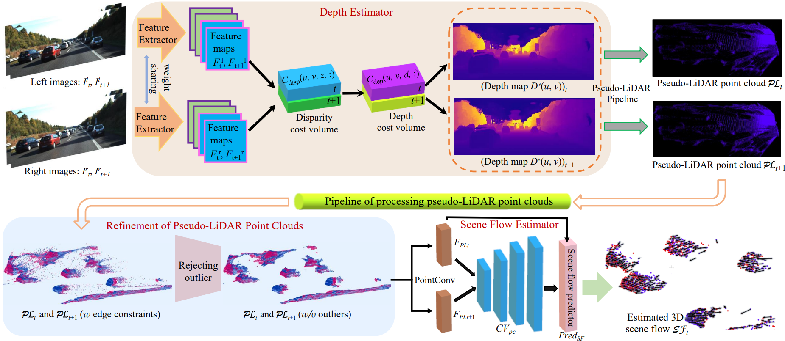

## 3D Scene Flow Estimation on Pseudo-LiDAR: Bridging the Gap on Estimating Point Motion (TII 2022)
This is an implementation for the paper entitled "3D Scene Flow Estimation on Pseudo-LiDAR: Bridging the Gap on Estimating Point Motion" published in IEEE Transactions on Industrial Informatics.
### Abstract

3D scene flow characterizes how the points at the current time flow to the next time in the 3D Euclidean space, which possesses the capacity to infer autonomously the non-rigid motion of all objects in the scene. The previous methods for estimating scene flow from images have limitations, which split the holistic nature of 3D scene flow by estimating optical flow and disparity separately. Learning 3D scene flow from point clouds also faces the difficulties of the gap between synthesized and real data and the sparsity of LiDAR point clouds. In this paper, the generated dense depth map is utilized to obtain explicit 3D coordinates, which achieves direct learning of 3D scene flow from 2D images. The stability of the predicted scene flow is improved by introducing the dense nature of 2D pixels into the 3D space. Outliers in the generated 3D point cloud are removed by statistical methods to weaken the impact of noisy points on the 3D scene flow estimation task. Disparity consistency loss is proposed to achieve more effective unsupervised learning of 3D scene flow. The proposed method of self-supervised learning of 3D scene flow on real-world images is compared with a variety of methods for learning on the synthesized dataset and learning on LiDAR point clouds. The comparisons of multiple scene flow metrics are shown to demonstrate the effectiveness and superiority of introducing pseudo-LiDAR point cloud to scene flow estimation.

### Note
We provide two versions of the code repository, an online version and an offline version. The online version means that the model is trained by just inputting stereo images for the 3D scene flow estimation model. The offline version means that a pseudo-LiDAR point cloud needs to be generated and saved to local area based on the trained depth estimation model beforehand, and then the generated pseudo-LiDAR point cloud is used to train the scene flow estimator.
